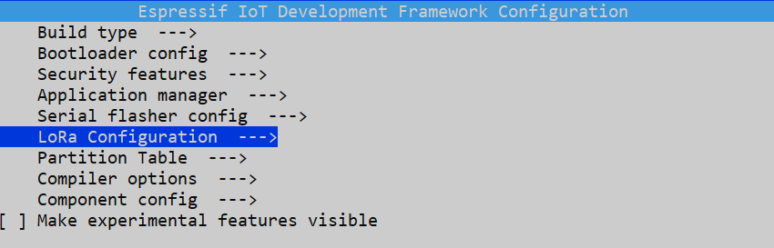
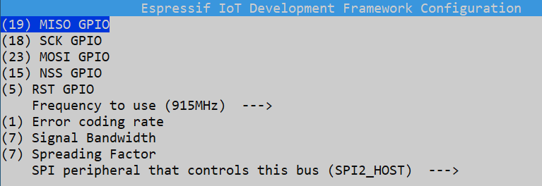
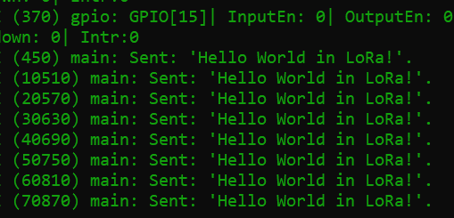
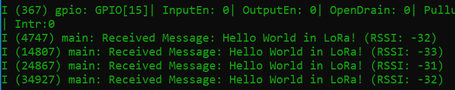

# ESP-IDF LoRa Class

An ESP-IDF component for sending and receiving data using LoRa radios. Based on **[Arduino-LoRa](https://github.com/sandeepmistry/arduino-LoRa/blob/master)**.

The idea of ​​this repository is to facilitate the use of the Lora module in ESP-IDF using C++ programming, trying to get as close as possible to the Arduino-LoRa library, which is already widely used.

The organization by object-oriented programming in C++ allows for better code modularization.

## Compatible Hardware 

- Boards based on **Semtech SX1276/77/78/79** chips, including **[RFM95W, RFM96W and RFM98W](https://cdn.sparkfun.com/assets/learn_tutorials/8/0/4/RFM95_96_97_98W.pdf).**

- Support for **ESP32S2, ESP32S3, ESP32C2, ESP32C3 and ESP32C6**.

## Wiring

| SX127X   | Brief Description | Default Pin (ESP32) |
| :--------:| :-----: | :-----: |
| **MISO** | Pin used as the MISO SPI signal | 19 |
| **MOSI** | Pin used as MISO SPI signal | 23 |
| **SCK** | Pin used as the SCK SPI signal | 18 |
| **CS** | LoRa NCS/SS pin | 15 |
| **RST** | LoRa NRST/RESET pin | 16 |
|

Configure the pins in **menuconfig** or use the `Lora.init(miso, mosi, sck, cs, rst)` method.

<figcaption>ESP menuconfig</figcaption>

###

<figcaption>Menu Lora Configuration</figcaption>

###

Remember to configure the SPI pins according to your board. To check the standard SPI pins on your board, access the **[ESPRESSIF documentation](https://docs.espressif.com/projects/esp-idf/en/latest/esp32/index.html).**

## Installation

1. Install the component into **esp-idf components folder**:
~~~sh
cd ~\Espressif\frameworks\esp-idf-v5.1.2\components
git clone https://github.com/FilipeIhancis/ESP-IDF-LoRa-Class/lora lora
~~~

2. In ``CMakeLists.txt`` file project, add the component folder:
~~~
set(EXTRA_COMPONENT_DIRS "C:/Espressif/frameworks/esp-idf-v5.1.2/components/lora")
~~~

3. Remember to rename the file ``main.c`` to ``main.cpp``.

## API

See **[API.md](API.md)**.

## Examples

See **[examples folder](examples)**: Lora Sender and Lora Receiver.

### Sender COM Port

### Receiver COM Port

## Reference:

- Arduino LoRa: https://github.com/sandeepmistry/arduino-LoRa
- ESP-IDF-SX126X:  https://github.com/nopnop2002/esp-idf-sx126x